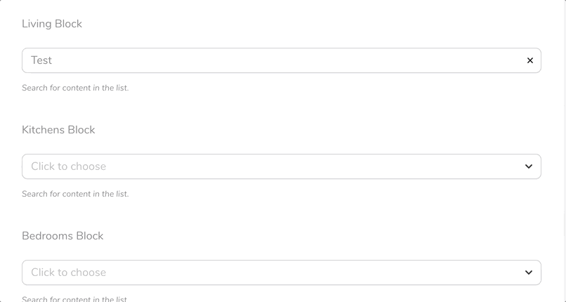
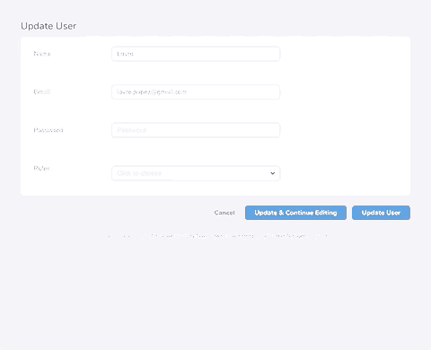

# Laravel Nova Searchable Select Field

A Searchable Select Field for Laravel Nova. This field joins the functionalities of the `BelongsTo`field
and `Select` field.

Basically a regular Select field where you specify the resource you want to search for and no "relationships"
are needed. This means, you can use it also in additional JSON fields in your database.

## Installation

_Composer_

```
composer require sloveniangooner/searchable-select
```

## Usage

Just like the regular select field, but instead of the `options` method you provide the `resource` method
with your resource name.

```php
use Sloveniangooner\SearchableSelect\SearchableSelect;
...

SearchableSelect::make('Content', 'content_id')->resource("contents")
... or
SearchableSelect::make("Content", "content_id")->resource(\App\Nova\Content::class)
```



You can pass all the regular options like:

```php
SearchableSelect::make('Content', 'content_id')
    ->resource("contents")
    ->help("Help text")
    ->displayUsingLabels()
    ->nullable()
```

But also two additional options:

```php
SearchableSelect::make('Content', 'content_id')
    ->resource("contents")
    ->label("custom_label_field") // Defaults to the static $title attribute of the resource class
    ->value("custom_value_field") // Defaults to 'id'
```

You can now also choose the multiple option. Needs a `text` or `json` field in the database.

```php
SearchableSelect::make('Content', 'content_id')
    ->resource("contents")
    ->multiple()
    ->displayUsingLabels()
    ->nullable()
```



Another option is to define the maximum number of items shown in the search. (Default: 20)

```php
SearchableSelect::make("Content", "content_id")
                ->resource("contents")
                ->max(10)
```

You can use the base model's search method instead of the Nova resource's search method with `useBaseSearch()`.

```php
SearchableSelect::make('Content', 'content_id')
    ->resource("contents")
    ->useBaseSearch()
```
